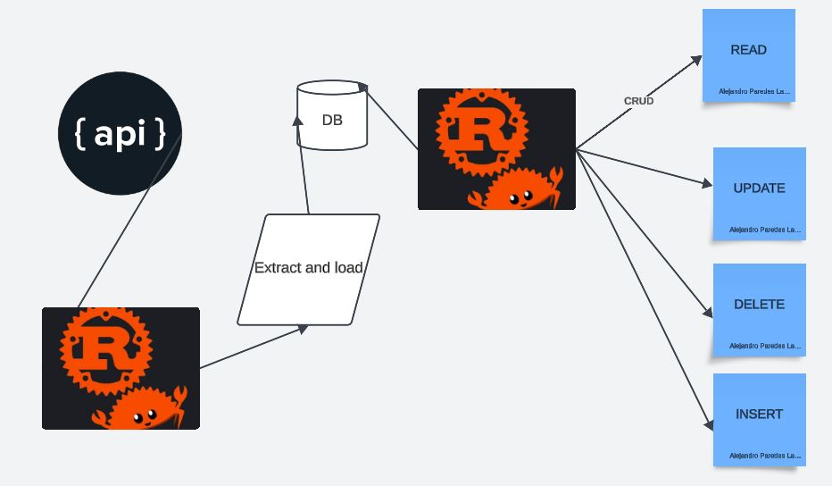

# IDS706_alejandroparedeslatorre_individualproject2_rustsql


This project is a Rust-based command-line application to manage university data, including ETL (Extract, Transform, Load) and CRUD (Create, Read, Update, Delete) operations. The project also includes a test suite to ensure each function works correctly.

We extract data from the api:

http://universities.hipolabs.com/search?country=United+States

Which is a toy dataset in json. And the loaded to the sql database.
Then we perform basic operations upon the database

According to the requirement we have

* `Makefile`

* `Dockerfile`

* `githubactions` 

* `.devcontainer` for Githubcodespace 

## You can find a brief introduction to the project in the following link:
[Project details and walkthrough](https://youtu.be/gAbbxg8MjZU)

## The architecture for the project is presented as follows:



## Use of Gen A:
I use Chatgpt to convert my previous Python code into Rust, but modify it as it isn't accurate and doesn't do error handling correctly at times.

## Features

- **ETL Process**: Extracts data from an external source, transforms it, and loads it into a database.
- **CRUD Operations**: Manages university entries, including creating, reading, updating, and deleting records.
* `Create` - insert
* `Read`
* `Update`
* `Delete`

- **Custom SQL Queries**: Supports custom SQL queries for data exploration.
- **Command-Line Interface (CLI)**: Run specific commands through the CLI.
- **CI/CD Pipeline**: Uses GitHub Actions to lint, test, and produce a downloadable, optimized release binary.

### Prerequisites

- [Rust](https://www.rust-lang.org/tools/install) (with `cargo`)
- [Git](https://git-scm.com/)

Clone the repository and navigate to the project directory:

```bash
git clone https://github.com/your_username/your_repo.git
cd your_repo
```

### Setup

Install dependencies and update the Rust toolchain:

```bash
make install
```

## Usage

### CLI Commands

The following commands are available in the `Makefile`:

- **Show Rust Tool Versions**: Displays versions of installed Rust tools.
  ```bash
  make rust-version
  ```

- **Code Formatting**: Formats the code using `rustfmt`.
  ```bash
  make format
  ```

- **Linting**: Runs `clippy` to lint the code.
  ```bash
  make lint
  ```

- **Testing**: Runs all tests.
  ```bash
  make test
  ```

- **Run in Debug Mode**: Compiles and runs the project in debug mode.
  ```bash
  make run
  ```

- **Build Release Binary**: Compiles an optimized release binary.
  ```bash
  make release
  ```

- **Run All Commands**: Installs dependencies, formats, tests, lints, builds a release binary, and runs the CLI.
  ```bash
  make all
  ```

### CLI Actions

Run the CLI with specific actions:

```bash
cargo run -- [action]
```

Available actions:

- **etl**: Perform the ETL process.
- **create**: Add a new university entry.
- **read**: Retrieve all university records.
- **update**: Update an existing university.
- **delete**: Remove a university record.
- **query**: Execute a custom SQL query (e.g., `cargo run -- query "SELECT * FROM Universities WHERE country='United States'"`).

## GitHub Actions

The project includes a GitHub Actions CI/CD pipeline that:

1. Checks out the code.
2. Installs dependencies and the Rust toolchain.
3. Formats, lints, and tests the code.
4. Builds an optimized binary.
5. Uploads the release binary as an artifact for download.

The workflow file (`.github/workflows/ci.yml`) is set to trigger on:
- Pushes to the `main` branch.
- Pull requests to the `main` branch.
- Manual dispatch.

After each run, download the optimized binary from the **Actions** tab on GitHub.

---

## Running Tests

Tests are located in `tests` modules within `etl` and `crud` modules and can be run with:

```bash
cargo test
```

Each test covers a different component, such as ETL, CRUD operations, and custom queries.